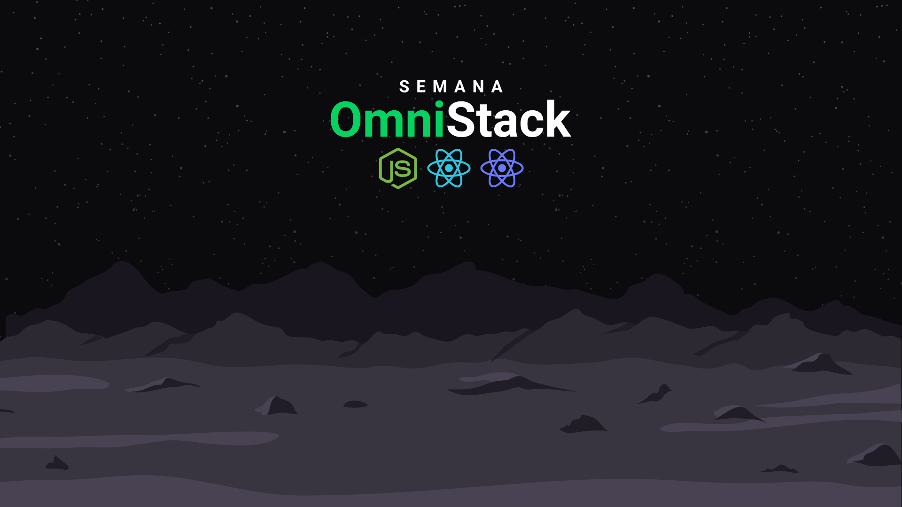

<h1 align="center">Semana Omnistack 10</h1>

Projeto <strong>DevRadar</strong> desenvolvido durante a 10ª Semana Omnistack da Rocketseat

</img>

## :rocket: Tecnologias

#### Esse projeto foi desenvolvido com as seguintes tecnologias:

[Node.js](https://nodejs.org/en/)
| 
[React](https://reactjs.org)
|
[React Native](https://facebook.github.io/react-native/)
|
[Expo](https://expo.io/)

## 🛰 Projeto

#### 🛰 DevRadar é um projeto para encontrar desenvolvedores por distância e tecnologias

## ⚛️ Frontend

</img>

## :memo: Licença

#### Esse projeto está sob a licença [MIT](./LICENSE) &copy; [Rocketseat](https://rocketseat.com.br/)
